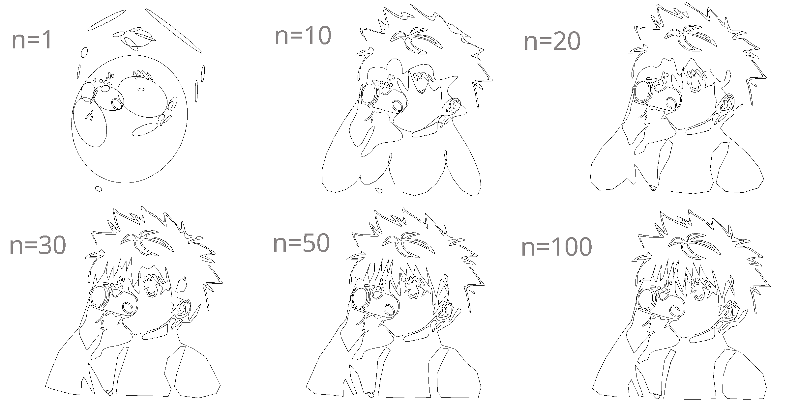
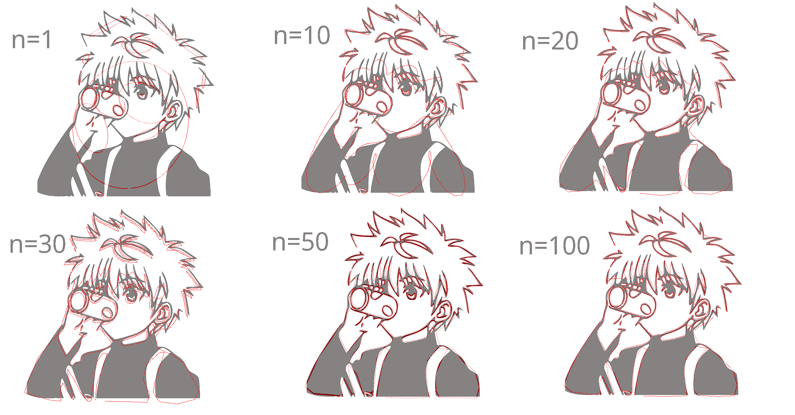

# Renders in Turtle Graphics.
### As the number of terms (n) in the fourier series is increased the curves become more and more accurate compared to the original. Although the curve becomes perfect with infinite number of terms in the series but that is for very complicated curves. Simpler curves require much less .
### Following are the renders of a sample image with various values of n.

# Comparisons against the original SVG.

# Where can this be further used?

### Our project can  be further scaled to.
- Lossy data compression (JPEG for example uses the discrete cosine transform function to efficiently compress lossily)
- Fast multiplication algorithms using FFT.
- Signal processing
- Spectral Analysis of Signals
- Image processing & filtering  
- Analog to digital coversion 
and many more.
